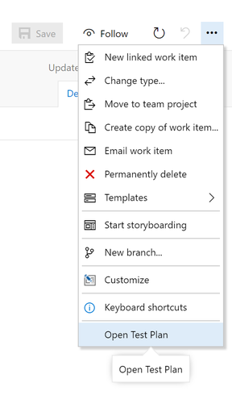
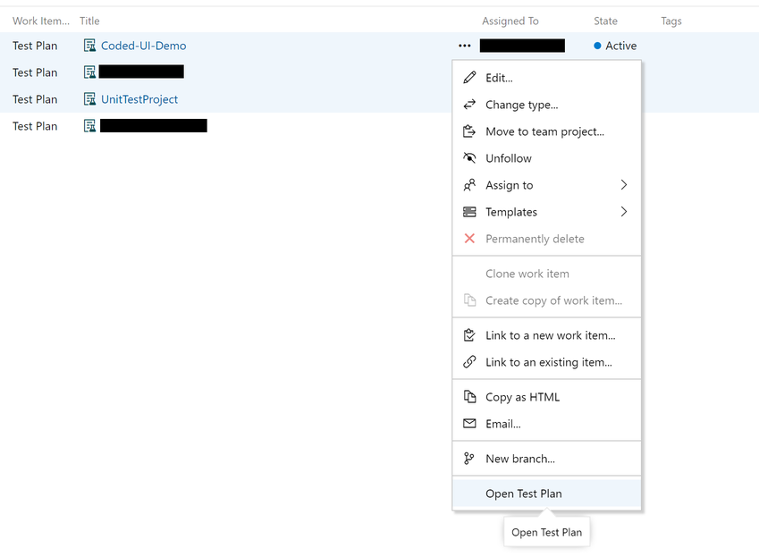
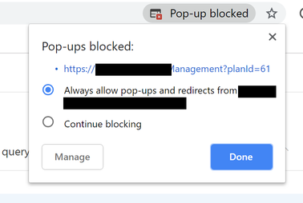

# Overview

The Open Test Plan extension allow you to easily open a test plan view in a new tab from the queries form.

## How to use

### From Work Item Form

Open a test plan work item and click on the three dots to open the context-menu.
Then click on Open Test Plan to open the test plan view in the test management hub.

### From Query Results

Query for test plan(s), select one or muliple test plan work item(s) and click on the three dots to open the context-menu.
Then click on Open Test Plan to open the test plan(s) view in the test management hub.

**Note:** You may need to enable pop-up in your browser.

